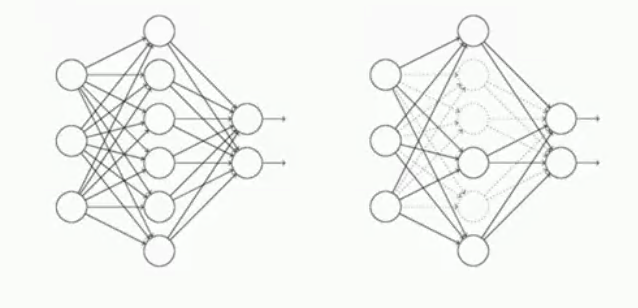

## 拟合

* 回归和分类中的拟合：欠拟合underfitting，正确拟合rightfitting，过拟合overfitting
* 防止过拟合：
    - 增加数据集；
    - 正则化方法：$C = C_0 + \frac{\lambda}{2n} \sum_w w^2$
    - Dropout：训练只有部分神经元工作，通常运用在数据集比较少的情况下； 
      


```python
import tensorflow as tf
from tensorflow.examples.tutorials.mnist import input_data   #手写数字相关的数据包
```


```python
# 载入数据集
mnist = input_data.read_data_sets("MNIST_data",one_hot=True)    #载入数据，{数据集包路径，把标签转化为只有0和1的形式}

#定义变量，即每个批次的大小
batch_size = 100    #一次放100章图片进去
n_batch = mnist.train.num_examples // batch_size   #计算一共有多少个批次；训练集数量（整除）一个批次大小

#定义两个placeholder
x = tf.placeholder(tf.float32,[None,784])    #[行不确定，列为784]
y = tf.placeholder(tf.float32,[None,10])    #数字为0-9，则为10
keep_prob = tf.placeholder(tf.float32)

#创建一个简单的神经网络
W1 = tf.Variable(tf.truncated_normal([784,2000],stddev=0.1))   #权重
b1 = tf.Variable(tf.zeros([2000])+0.1)     #偏置
L1 = tf.nn.tanh(tf.matmul(x,W1)+b1)    #激活函数
L1_drop = tf.nn.dropout(L1,keep_prob)    #使用dropout，keep_prob为百分比即多少比例的神经元在工作

#创建隐藏层
W2 = tf.Variable(tf.truncated_normal([2000,2000],stddev=0.1))   #权重
b2 = tf.Variable(tf.zeros([2000])+0.1)     #偏置
L2 = tf.nn.tanh(tf.matmul(L1_drop,W2)+b2)    #激活函数
L2_drop = tf.nn.dropout(L2,keep_prob)    #使用dropout，keep_prob为百分比即多少比例的神经元在工作

W3 = tf.Variable(tf.truncated_normal([2000,1000],stddev=0.1))   #权重
b3 = tf.Variable(tf.zeros([1000])+0.1)     #偏置
L3 = tf.nn.tanh(tf.matmul(L2_drop,W3)+b3)    #激活函数
L3_drop = tf.nn.dropout(L3,keep_prob)    #使用dropout，keep_prob为百分比即多少比例的神经元在工作

W4 = tf.Variable(tf.truncated_normal([1000,10],stddev=0.1))   #权重
b4 = tf.Variable(tf.zeros([10])+0.1)     #偏置

prediction = tf.nn.softmax(tf.matmul(L3_drop,W4)+b4)    #预测

#定义二次代价函数
# loss = tf.reduce_mean(tf.square(y-prediction))
#定义交叉熵代价函数
loss = tf.reduce_mean(tf.nn.softmax_cross_entropy_with_logits(labels=y,logits=prediction))
#使用梯度下降法
train_step = tf.train.GradientDescentOptimizer(0.2).minimize(loss)

#初始化变量
init = tf.global_variables_initializer()

#准确数，结果存放在一个布尔型列表中
correct_prediction = tf.equal(tf.argmax(y,1),tf.argmax(prediction,1))   #比较两个参数大小是否相同，同则返回为true，不同则返回为false；argmax()：返回张量中最大的值所在的位置

#求准确率
accuracy = tf.reduce_mean(tf.cast(correct_prediction,tf.float32))   #cast()：将布尔型转换为32位的浮点型；（比方说9个T和1个F，则为9个1，1个0，即准确率为90%）

with tf.Session() as sess:
    sess.run(init)
    for epoch in range(31):
        for batch in range(n_batch):
            batch_xs,batch_ys = mnist.train.next_batch(batch_size)
            sess.run(train_step,feed_dict={x:batch_xs,y:batch_ys,keep_prob:1.0})
            
        test_acc = sess.run(accuracy,feed_dict={x:mnist.test.images,y:mnist.test.labels,keep_prob:1.0})
        train_acc = sess.run(accuracy,feed_dict={x:mnist.train.images,y:mnist.train.labels,keep_prob:1.0})
        print("Iter" + str(epoch) + ",Testing Accuracy" + str(test_acc) + ",Training Accuracy" + str(train_acc))

```
